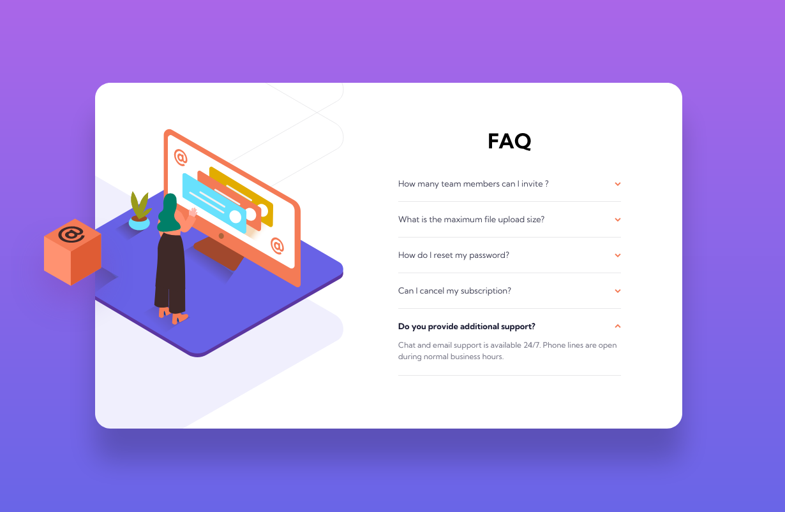
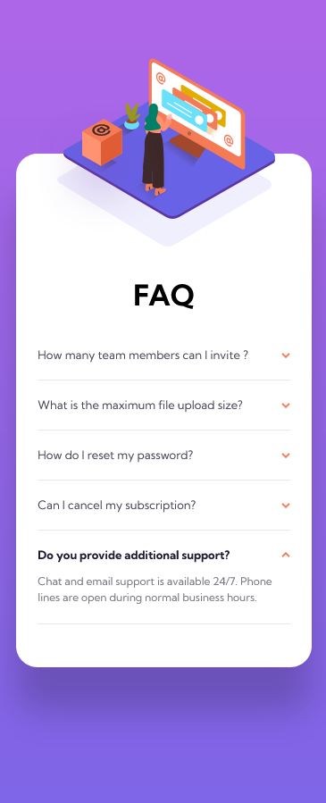

# Frontend Mentor - FAQ accordion card solution

This is a solution to the [FAQ accordion card challenge on Frontend Mentor](https://www.frontendmentor.io/challenges/faq-accordion-card-XlyjD0Oam). Frontend Mentor challenges help you improve your coding skills by building realistic projects. 

## Table of contents

- [Overview](#overview)
  - [The challenge](#the-challenge)
  - [Links](#links)
- [My process](#my-process)
  - [Built with](#built-with)
  - [What I learned](#what-i-learned)
  - [Continued development](#continued-development)
  - [Useful resources](#useful-resources)
- [Author](#author)
- [Acknowledgments](#acknowledgments)

## Overview

### The challenge

Users should be able to:

- View the optimal layout for the component depending on their device's screen size
- See hover states for all interactive elements on the page
- Hide/Show the answer to a question when the question is clicked

### Links

- Solution URL: 
- Live Site URL: [Vercel hosted](https://fem-accordion-card-ten.vercel.app/)

## My process

### Built with

- Semantic HTML5 markup
- SCSS
- Javascript
- Mobile-first workflow

### What I learned

:v: Second FrontEndMentor challenge completed ! 
I complicated things at first by trying to make the images responsive in size with the screen width, to be able to have a flexible width for mobile.
I ended up just leaving a fixed size but learned some [awesome ways](https://adrienzaganelli.com/blog/time-saving-css-techniques-to-create-responsive-images/) to get responsive images !
I also tried to implement BEM to get some, I think, clean and maintainable SCSS code.

### Acknowledgments

- [HTML inspiration](https://github.com/vanzasetia/faq-accordion-card) - I looked at other solutions after completing the project and this one was very exhaustive, lots of HTML tags I didn't know about, and general good code quality.